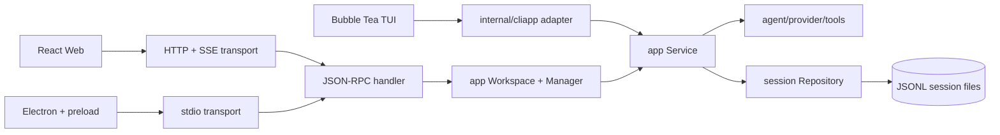

# gg architecture

`gg` keeps product behavior in a reusable Go core and treats every interface as an adapter. The TUI, Web app, and Electron client therefore share session semantics, concurrency rules, approval handling, and tool execution.

## Package responsibilities

| Package | Responsibility |
| --- | --- |
| `internal/app` | Application use cases, session actions, turn execution, run lifecycle, approvals, event replay, and transport-safe DTOs. |
| `internal/session` | JSONL persistence, tree reconstruction, migrations, durable branch head, cross-process writer leases, conflict detection, and repository lookup by stable session ID. |
| `internal/agent` | Provider loop, tool calls, approvals, and streaming agent events. |
| `internal/transport/jsonrpc` | Stable method names and request/response validation. It contains no UI or filesystem policy. |
| `internal/transport/stdio` | Concurrent newline-delimited JSON-RPC for local child processes. |
| `internal/transport/httpapi` | Bearer-protected RPC plus replayable SSE events for browser deployments. |
| `internal/daemon` and `cmd/ggd` | Composition root for config, provider, repository, workspace, and transports. |
| `internal/cliapp` | CLI/TUI composition only. Business behavior delegates to `app.Service`. |
| `internal/tui` | Bubble Tea state and rendering only; conversation DTOs come from the core. |
| `ui/src` | Shared React interface and transport abstraction. |
| `ui/electron` | Native window, workspace picker, sidecar lifecycle, and a narrow context-isolated IPC bridge. |

Dependencies point inward: UI and transports depend on application use cases; the application layer depends on agent and persistence abstractions; the core never imports a UI or network package.

## Runtime model

- A `Workspace` opens sessions by stable ID and never exposes session file paths over the network boundary.
- A `Manager` owns open conversation services. Different sessions may run concurrently, while one session permits only one active run. Inactive sessions are evicted least-recently-used, and completed runs expire by count and age.
- Each turn receives a run ID. Events carry a monotonically increasing sequence number and remain replayable through `run.wait` or `/events` within a bounded retention window. A client that falls behind receives `event_history_expired` and reloads the session snapshot.
- Tool approval is asynchronous: an `approval_requested` event pauses the tool, and `run.approve` resolves it. Cancellation and steering use the same run/session boundary.
- Fork and clone create independent services and stores. Checkout writes a `head` entry so the selected tree position survives a restart even if no new message is sent.
- JSONL writes use a short-lived cross-process lease plus optimistic head validation. A stale CLI or daemon receives `session_conflict` instead of silently interleaving branches.

## Public JSON-RPC surface

The transport-independent methods are:

- `system.info` for the gg protocol version and capability negotiation
- `session.list`, `session.create`, `session.open`, `session.get`, `session.rename`
- `session.action` with `tree`, `fork`, or `clone`
- `run.start`, `run.wait`, `run.cancel`, `run.approve`, `run.steer`

stdio uses one JSON-RPC object per line and supports concurrent requests, which is required while one request is waiting for an approval. HTTP accepts JSON-RPC at `POST /rpc`; `GET /events` streams run events as SSE. HTTP mode requires a Bearer token and binds only to loopback unless `--allow-remote` is explicit. JSON-RPC 2.0 remains the wire format; `system.info.protocolVersion` independently versions gg methods, events, DTOs, and stable application error codes.

## Client boundary

The React app depends on a small `Transport` interface. `WebTransport` calls same-origin HTTP by default. `ElectronTransport` invokes only the whitelisted methods exposed by `preload.cjs`; renderer code has no Node.js access. The Electron main process owns `ggd` and the selected workspace.

## Extension rules

When adding behavior:

1. Put the use case and its tests in `internal/app`.
2. Add or change persistence behind `session.Repository`.
3. Expose a transport-neutral method/event only when a client needs it.
4. Keep Web- or Electron-specific policy in its adapter.
5. Keep file paths, provider secrets, and unrestricted IPC out of public DTOs.

This makes a future mobile client, remote Web deployment, or alternative terminal UI another adapter rather than another implementation of the agent.
