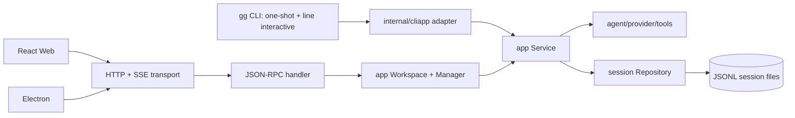

# gg architecture

`gg` keeps product behavior in a reusable Go core and treats every interface as an adapter. The CLI, Web app, and Electron client therefore share session semantics, concurrency rules, approval handling, and tool execution.


```mermaid
flowchart LR
    CLI[gg CLI: one-shot + line interactive] --> CLIAPP[internal/cliapp adapter]
    WEB[React Web] --> HTTP[HTTP + SSE transport]
    DESKTOP[Electron] --> HTTP
    CLIAPP --> CORE[app Service]
    HTTP --> RPC[JSON-RPC handler]
    RPC --> WORKSPACE[app Workspace + Manager]
    WORKSPACE --> CORE
    CORE --> AGENT[agent/provider/tools]
    CORE --> REPO[session Repository]
    REPO --> JSONL[(JSONL session files)]
```

## Package responsibilities

| Package | Responsibility |
| --- | --- |
| `internal/app` | Application use cases, session actions, turn execution, run lifecycle, approvals, event replay, and transport-safe DTOs. |
| `internal/session` | JSONL persistence, tree reconstruction, migrations, durable branch head, cross-process writer leases, conflict detection, and repository lookup by stable session ID. |
| `internal/agent` | Provider loop, tool calls, approvals, and streaming agent events. |
| `internal/transport/jsonrpc` | Stable method names and request/response validation. It contains no UI or filesystem policy. |
| `internal/transport/stdio` | Concurrent newline-delimited JSON-RPC for local child processes. |
| `internal/transport/httpapi` | Bearer-protected RPC plus replayable SSE events for browser deployments. |
| `internal/daemon` and `cmd/ggd` | Composition root for config, provider, repository, workspace, and transports. |
| `internal/cliapp` | CLI composition only (one-shot prompts, line-based interactive mode, management commands). Business behavior delegates to `app.Service`. |
| `internal/userprofile` | User profile (`~/.gg/USER.md`): load, parse, and render the "who you are" system block. |
| `internal/memory` | Structured memory store (`~/.gg/memory/`): curated `MEMORY.md`, daily logs `YYYY-MM-DD.md`, `people/` and `groups/` notes, legacy `memory.md` migration, daily-log pruning, and keyword search. |
| `internal/scheduler` | Cron/once job definitions, file-locked JSON store (`~/.gg/scheduler/`), the firing loop, and the unattended approval policy. The daemon provides the `Executor`; the core never imports the agent runtime except for the approver types. |
| `internal/artifact` | Versioned agent-produced deliverables: `~/.gg/artifacts/<id>/` holds `artifact.json` plus immutable `v1.md`, `v2.md`, … Create/version/publish/remove; markdown and HTML types; owner-only permissions (0600 files, 0700 dir). Version allocation and publish marking are serialized with an flock on `artifacts.lock`. |
| `internal/library` | The user's curated file collection (`~/.gg/library/`): flat files plus `index.json` (`id`, `name`, `source`, `size`, `added_at`). Accepts uploads (`Add`) and in-memory content (`AddBytes`, used by artifact publish). Mutations are serialized with an flock on `library.lock`; `index.json` is a reserved name and collisions are case-insensitive. |
| `internal/filelock` | Cross-process exclusive file locking (flock) shared by the artifact and library stores; explicit error on platforms without flock. |
| `internal/connector` | Third-party connection framework: OAuth 2.0 authorization-code flow (localhost callback + PKCE, `state` CSRF check), token persistence (`~/.gg/connectors/<name>.json`, 0600, flock-serialized), on-demand refresh. |
| `internal/connector/google` | First provider: Gmail (search/read/send) and Google Calendar (agenda/create) over plain `net/http`; auto-refresh transport with one 401 retry. Scopes: `gmail.readonly` + `gmail.send` + `calendar.events`. |
| `internal/tools` | Builtin agent tool implementations, including the computer tools (`computer.go` plus per-OS backends `computer_linux.go` / `computer_darwin.go`; Windows and other Unixes get unsupported stubs). Trust boundary: tools run with the user's own OS privileges — any write or external side effect must implement `agent.ApprovalDescriber` so every call passes the approval pipeline. |
| `internal/mcp` | MCP client on the official `modelcontextprotocol/go-sdk`: config (`~/.gg/mcp.json`), stdio/HTTP dialing, schema adaptation, and the `mcp_<server>_<tool>` tool bridge. Trust boundary: servers are third-party code — stdio subprocesses inherit only a minimal environment, every MCP tool is approval-gated, and a server that fails to dial or list is skipped for the `Service`'s lifetime. |
| `ui/src` | Shared React UI; Web and Electron use the same HTTP transport. |
| `ui/electron` | Native window, workspace picker, and sidecar lifecycle: spawns `ggd --http` with a per-launch random token and hands the renderer only its endpoint + token over a narrow context-isolated bridge. |

Dependencies point inward: UI and transports depend on application use cases; the application layer depends on agent and persistence abstractions; the core never imports a UI or network package.

## Personal layer (profile + memory)

`app.SetupPersonal(cfg)` runs at every CLI and daemon startup and wires the personal layer into the system prompt:

1. `internal/userprofile`: loads `~/.gg/USER.md` (created by `gg init`; missing file is fine, failures never block startup) and renders a compact "who you are" block: name/call name, timezone, language, notes.
2. `internal/memory`: ensures `~/.gg/memory/`, migrates a legacy `~/.gg/memory.md` into `memory/MEMORY.md` (legacy file renamed to `memory.md.bak`, never overwritten when curated content already exists), prunes expired daily logs, and snapshots prompt content.

System prompt assembly order (after the coding instructions): user profile, curated memory (`MEMORY.md`), today's daily-log tail (`YYYY-MM-DD.md`), then project instructions (AGENTS.md) and skills. Tool surface: `memory_add` accepts `scope=general|daily|person:<name>|group:<name>` (default general); `memory_search` does case-insensitive keyword search across scopes and returns up to 10 `path:line: snippet` hits. Both are hidden when memory is disabled.

## Scheduler (cron / once jobs)

`internal/scheduler` owns job definitions and the firing loop; `internal/daemon` wires it into the running daemon (`ggd`), and `gg job ...` (in `internal/cliapp`) manages jobs from any process:

1. **Store**: `~/.gg/scheduler/jobs.json` (definitions, written atomically via rename) and `runs.jsonl` (append-only run log, one JSON object per line). All `jobs.json` read-modify-write cycles are serialized with an `flock` on `jobs.lock` (Linux/macOS only), so the CLI and the daemon can edit jobs concurrently. Pure reads use `View` and never rewrite the file. State files are owner-only (`0600`, directory `0700`), matching session and memory persistence.
2. **Loop**: the daemon runs `Scheduler.Run(ctx)` in the background (`ggd --no-scheduler` disables it). The wait for the next firing is capped at 30s so jobs added or resumed by the CLI while the loop sleeps are picked up promptly. Each tick advances a due job's persisted `NextRun` before dispatching its goroutine, so a long run can never make the loop spin on the same firing; a firing that arrives while the previous run is still in flight is recorded once as "skipped" and its `NextRun` advanced as well. A per-job in-memory guard still prevents overlapping executions. Transient store errors — including a failed startup reconciliation — are reported to the daemon's stderr and retried instead of killing the loop.
3. **Execution**: every firing runs one agent turn in a fresh session (`scheduler/<name>-<timestamp>`) via `app.Workspace.StartTurnWithApprover`, so runs are auditable and resumable. The job's `Timeout` (default 10m) bounds the turn. A job records the workspace directory it was created from; the daemon only fires jobs whose workspace matches its own (jobs created before workspace tracking, with an empty value, fire anywhere).
4. **Approval policy**: `scheduler.UnattendedApprover` denies every approval-gated tool by default; a job created with `--allow-all` opts in. This is injected explicitly — the scheduler never relies on a nil approver, which the runner would treat as "allow everything".
5. **Restart semantics**: cron jobs are rescheduled from the current time (missed firings are not caught up); a past-due once job that never ran fires once on daemon startup. The daemon writes `~/.gg/ggd.pid` so `gg job add` can warn when no daemon is alive to fire jobs.

## Daemon channels and supervision

Long-running daemon services (the job scheduler, the Telegram bot) run as
*channels* behind one shared launch path in `internal/daemon`:

1. **Panic isolation**: every channel goroutine, every Telegram update handler,
   and every stdio JSON-RPC request handler recovers from panics, logs the
   stack trace, and keeps serving — one bad message or request can never take
   the whole daemon down. A panicking Telegram update is acked (not
   re-delivered) because the panic is deterministic for that input; a
   panicking stdio request gets a JSON-RPC `-32603` internal-error response
   (notifications stay response-free, even on panic). Panics one level
   deeper are contained too: a panicking scheduled-job execution is recorded
   as a failed run and reported, and a panicking agent turn finishes its run
   as failed instead of killing the daemon.
2. **Liveness**: a channel that fails at runtime is reported and left stopped
   (it never takes the daemon down with it). Per-channel state
   (`running`/`failed`/`stopped`, plus the error and timestamp) is tracked by
   a monitor and served on the authenticated `GET /health` endpoint as
   `channels`; the unauthenticated `/healthz` stays a pure process-liveness
   probe.
3. **Single instance**: `ggd` holds an exclusive `flock` on `~/.gg/ggd.pid`
   for its whole lifetime, and the outcome is fail-closed: a second full
   daemon gets "already running" and refuses to start, and any failure to
   establish the lock at all refuses startup rather than running unguarded
   (which would risk duplicate scheduled jobs and duplicate Telegram
   replies). The lock — not the pid inside — is the guard, so a crashed
   daemon can never block a fresh start. The one exception is a
   parent-supervised sidecar (`--exit-on-stdin-eof`, e.g. the Electron app):
   when another instance already owns the channels, the sidecar serves its
   API without starting the scheduler/messaging channels instead of failing
   outright. `~/.gg` and the pid file are owner-only (`0700`/`0600`),
   enforced on existing paths too, matching the other state stores.

## Artifacts and library

`internal/artifact` owns versioned deliverables; `internal/library` owns the user's file collection; the two meet at publish time:

1. **Store**: `~/.gg/artifacts/<id>/artifact.json` (id, title, type, version, published_version, timestamps) plus immutable `v<n>.md` / `v<n>.html` files, all written atomically (temp file + rename). `artifact_edit` appends a full new version — never a diff merge — so every version stays reproducible. Supported types are `markdown` and `html`; content is capped at 1 MiB per version so artifacts cannot blow up the agent context. All read-modify-write cycles are serialized with an `flock` on `artifacts.lock` (via `internal/filelock`), so concurrent edits from the CLI and the daemon cannot allocate the same version number. `List` always returns a non-nil slice so JSON callers see `[]`, not `null`, on an empty store.
2. **Agent tools**: `artifact_create(title, type, content)` and `artifact_edit(artifact_id, content)`, registered via the `artifact` entry in `app.toolProviders` when the store opens. Both implement `ApprovalRequest` (title/type/size plus a before/after content preview) because they write outside the working directory; the unattended approver denies them unless the job opted into `--allow-all`.
3. **Publish**: `gg artifact publish <id>` and the Web Publish button (JSON-RPC `artifact.publish`) share one flow in `app.Workspace.PublishArtifact`: the latest version's bytes are saved into the library first (`library.AddBytes` → `~/.gg/library/<slug>.<ext>`, source `artifact:<id>`), and only then is the artifact's `published_version` advanced. `Store.Publish(id, expectedVersion)` refuses with `ErrVersionChanged` when the artifact gained a newer version between the caller's read and the mark — the half-saved library copy is removed and the caller retries instead of recording a published version whose bytes were never saved.
4. **Library**: `gg library add <path> [--name]` copies a regular file (≤ 50 MiB, enforced on the actual copied bytes, not the pre-copy stat) into `~/.gg/library/` with collision-safe naming; `index.json` is the source of truth and is updated atomically. Name collisions are detected case-insensitively (the macOS default filesystem is case-insensitive) and the reserved name `index.json` is rejected, so an upload can never overwrite or delete the index. All mutations run under an `flock` on `library.lock` so concurrent adds cannot reserve the same name or drop each other's entries. `library list|remove|path` manage entries by id or case-insensitive name.
5. **Web**: `artifact.list` / `artifact.get` / `artifact.publish` over the existing JSON-RPC transport; `system.info` advertises the `artifact` capability and the Web client only shows the Artifacts tab when the connected daemon reports it. The React Artifacts tab renders markdown with `marked` and HTML inside `<iframe sandbox="">` (no scripts execute). The reader always shows the latest version (drafts added after publishing stay visible); the Publish button appears whenever `publishedVersion < version`. Trust boundary: artifact content comes from the local user's own agent or files, same trust as the chat transcript.

## Runtime model
- A `Workspace` opens sessions by stable ID and never exposes session file paths over the network boundary.
- A `Manager` owns open conversation services. Different sessions may run concurrently, while one session permits only one active run. Inactive sessions are evicted least-recently-used, and completed runs expire by count and age.
- Each turn receives a run ID. Events carry a monotonically increasing sequence number and remain replayable through `run.wait` or `/events` within a bounded retention window. SSE frames include sequence IDs and idle heartbeats, so Web clients can reconnect with exponential backoff and resume from the last event. A client that falls behind receives `event_history_expired` and reloads the session snapshot.
- `run.active` and `run.get` expose reconnect-safe run state, including the retained sequence window and pending approvals. On reload, Web and Electron clients reopen the last selected session and reattach to its active run.
- Tool approval is asynchronous: an `approval_requested` event pauses the tool, and `run.approve` resolves it. Cancellation and steering use the same run/session boundary.
- Fork and clone create independent services and stores. Checkout writes a `head` entry so the selected tree position survives a restart even if no new message is sent.
- JSONL writes use a short-lived cross-process lease plus optimistic head validation. A stale CLI or daemon receives `session_conflict` instead of silently interleaving branches.

## Public JSON-RPC surface

The transport-independent methods are:

- `system.info` for the gg protocol version and capability negotiation
- `session.list`, `session.create`, `session.open`, `session.get`, `session.rename`
- `session.action` with `tree`, `fork`, or `clone`
- `run.start`, `run.wait`, `run.get`, `run.active`, `run.cancel`, `run.approve`, `run.steer`
- `artifact.list`, `artifact.get`, `artifact.publish`

stdio uses one JSON-RPC object per line and supports concurrent requests, which is required while one request is waiting for an approval. HTTP accepts JSON-RPC at `POST /rpc`; `GET /events` streams run events as SSE. HTTP mode requires a Bearer token and binds only to loopback unless `--allow-remote` is explicit. The packaged Electron renderer loads from `file://` (origin `null`), so the daemon answers CORS preflights (`OPTIONS`) from `null` and loopback `http(s)` origins outside the bearer-token gate; the token stays the real authentication boundary. JSON-RPC 2.0 remains the wire format; `system.info.protocolVersion` independently versions gg methods, events, DTOs, and stable application error codes.

## Client boundary

The React app depends on a small `Transport` interface. `HttpTransport` talks to `ggd` over Bearer-protected HTTP (POST `/rpc` plus SSE `/events`) and is shared by the Web and Electron clients. On desktop, the Electron main process spawns `ggd --http 127.0.0.1:<port> --token <random> --exit-on-stdin-eof` and exposes only the endpoint, token, and workspace label to the renderer; renderer code has no Node.js access. The sidecar's stdin is a control pipe that the main process holds: if the parent dies without cleanup (crash/SIGKILL skips `before-quit`), stdin reaches EOF and the daemon shuts itself down instead of lingering as an orphan.

The CLI (`gg -p`, script mode, and management commands) is deliberately not a thin client: it runs the agent in-process through `internal/cliapp` and never talks to `ggd` over HTTP. This keeps the CLI usable with no daemon running, with lower latency and script-friendly behavior, at the cost of two execution paths for the same agent logic (in-process vs. `ggd`-hosted for Web/Electron). This is a known trade-off, not an oversight: converge the CLI onto the HTTP transport only if the two paths observably drift in behavior.

## Extension rules

When adding behavior:

1. Put the use case and its tests in `internal/app`.
2. Add or change persistence behind `session.Repository`.
3. Expose a transport-neutral method/event only when a client needs it.
4. Keep Web- or Electron-specific policy in its adapter.
5. Keep file paths, provider secrets, and unrestricted IPC out of public DTOs.
6. Add a new agent capability as a `ToolProvider` entry, an MCP server declaration, or a skill — never a central if/else chain. If it writes or causes an external side effect, implement `agent.ApprovalDescriber` so the unattended approver denies it by default.
7. Platform- or environment-dependent tools degrade through `Available`/`Build` and are never advertised when unavailable; `ToolCapabilities()` stays derived from the registry.
8. External code and prompt content (MCP servers, skills) run at the lowest trust: scrubbed subprocess environments, approval-gated tools, fail-skip instead of fail-fatal.

This makes a future mobile client, remote Web deployment, or alternative terminal UI another adapter rather than another implementation of the agent.

### Adding agent tools

Tools are assembled per turn by the `ToolProvider` registry (`internal/app/toolregistry.go`): each provider's `Build` returns one capability's tools, and a nil slice or error degrades that capability to absent without affecting the rest. To add a tool:

1. Implement `agent.Tool` in `internal/tools` (or the capability's own package).
2. Add or extend a `ToolProvider` entry in `toolProviders` — never a central if/else chain.
3. If the tool performs a write or external side effect, implement `agent.ApprovalDescriber` so every call passes through the approval pipeline (the unattended approver denies approval-gated tools unless the job opted in).

Transports advertise capabilities from `app.ToolCapabilities()`, which is derived from the registry, so the advertised set cannot drift from the tools actually registered.

### MCP servers

External tools come from MCP servers declared in `~/.gg/mcp.json`:

```json
{"servers": {
  "filesystem": {"command": "npx", "args": ["-y", "@modelcontextprotocol/server-filesystem", "/data"], "env": {"API_KEY": "..."}},
  "remote": {"url": "https://example.com/mcp"}
}}
```

`internal/mcp` dials each server (stdio subprocess or streamable HTTP) and adapts its tools as `mcp_<server>_<tool>` (sanitized to function-calling-safe names, max 64 chars, numeric suffix on collision). Server tools always implement `ApprovalDescriber`: every MCP call is approval-gated. Connections are memoized per `Service` (one dial per conversation) and reaped on `Service.Close`. A server that fails to dial or list is skipped for the Service's lifetime, so one broken server cannot slow every turn. stdio servers inherit only a minimal environment (PATH/HOME plus the server's own `env` map) — the parent process environment is never passed through wholesale.

### Skills

Skills (`internal/skills`) are the third extension layer: markdown playbooks loaded from project skill roots and `~/.agents/skills`, read by the model on demand. A skill adds knowledge and procedure, not code execution — the agent carries out skill steps with the existing tool surface, so a skill inherits the approval policy of the tools it uses. Trust boundary: skills are prompt content from the repo or the user's own files; treat third-party skill text like any untrusted prompt input.

### Extension layers

The three layers, from most to least trusted:

1. **Builtin providers** (`internal/app/toolregistry.go`): compiled into gg, built per turn, degrading to absent when prerequisites are missing (no Chromium, Google not connected) or unsupported on the platform (`Available` gate). Writes and external side effects implement `agent.ApprovalDescriber`. Worked example: the computer tools — `internal/tools/computer.go` plus per-OS backends; on Windows and other Unixes the capability is neither built nor advertised.
2. **MCP servers** (`~/.gg/mcp.json`, `internal/mcp`): external processes exposing tools as `mcp_<server>_<tool>`; always approval-gated; connections memoized per `Service`; a broken server is skipped, never fatal.
3. **Skills** (`internal/skills`): markdown procedures the model reads on demand; no new code runs; approval comes from the tools the steps use.

**Deliberate decision — browser navigation is approval-gated.** `browser_navigate` requires user approval: the URL shown in the approval prompt is checked against the SSRF guard (which rejects cloud metadata, localhost, intranet targets) before Chromium ever connects, and the user confirms the exact destination. This was tightened because the SSRF guard only inspects the *initial* URL — Chromium follows redirects and page subresources on its own, so an initial-URL check alone cannot keep navigation off internal targets. `browser_read` and `browser_screenshot` stay exempt: they operate on the page the user already approved and cannot trigger new navigation. Residual risks: (1) post-approval redirects can still reach internal hosts (Chromium follows them without re-check); (2) in-context data can be exfiltrated by embedding it in a fetched URL — accepted, since secrets should not sit in the agent's context unprotected. Approval-gating only the navigation (not every read) keeps autonomous research usable: one approval opens the page, subsequent reads are free.

`app.ToolCapabilities()` derives the advertised set from the registry, so clients never see a capability whose tools cannot be built.

## Quality gates

Every PR is expected to arrive green and stay reviewable:

- **CI**: the 6 checks (Go on ubuntu-latest and macos-latest, Web and Electron) must pass; `go vet ./...` runs in CI and must be clean.
- **Race**: `go test -race` on `internal/app`, `internal/session`, `internal/transport/...` (CI runs this on Linux).
- **Format**: `gofmt -l` clean. Run `make check` locally before pushing — it runs format, vet, and the full test suite.
- **New packages**: interfaces first, unit tests on the core paths, typed errors, doc comments on exported symbols.
- **Size**: keep PRs under ~500 lines so one reviewer can hold them in their head; split bigger work into stacked phases.
- **Review**: Codex review findings are verified independently — a finding is fixed only after confirming it against the code, not on the review's say-so. Valid P0/P1/P2 are fixed; P3s are judgment calls. Merge only on green CI.
- **Platforms**: Linux and macOS are supported. `internal/tools` and `internal/app` must also compile for Windows (`GOOS=windows go build`), and every new platform-split file needs an `other` stub so the package compiles on any Unix target.
