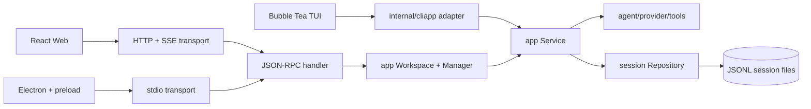

# gg architecture

`gg` keeps product behavior in a reusable Go core and treats every interface as an adapter. The TUI, Web app, and Electron client therefore share session semantics, concurrency rules, approval handling, and tool execution.

```mermaid
flowchart LR
    TUI[Bubble Tea TUI] --> CLIAPP[internal/cliapp adapter]
    WEB[React Web] --> HTTP[HTTP + SSE transport]
    DESKTOP[Electron + preload] --> STDIO[stdio transport]
    CLIAPP --> CORE[app Service]
    HTTP --> RPC[JSON-RPC handler]
    STDIO --> RPC
    RPC --> WORKSPACE[app Workspace + Manager]
    WORKSPACE --> CORE
    CORE --> AGENT[agent/provider/tools]
    CORE --> REPO[session Repository]
    REPO --> JSONL[(JSONL session files)]
```

## Package responsibilities

| Package | Responsibility |
| --- | --- |
| `internal/app` | Application use cases, session actions, turn execution, run lifecycle, approvals, event replay, and transport-safe DTOs. |
| `internal/session` | JSONL persistence, tree reconstruction, migrations, durable branch head, cross-process writer leases, conflict detection, and repository lookup by stable session ID. |
| `internal/agent` | Provider loop, tool calls, approvals, and streaming agent events. |
| `internal/transport/jsonrpc` | Stable method names and request/response validation. It contains no UI or filesystem policy. |
| `internal/transport/stdio` | Concurrent newline-delimited JSON-RPC for local child processes. |
| `internal/transport/httpapi` | Bearer-protected RPC plus replayable SSE events for browser deployments. |
| `internal/daemon` and `cmd/ggd` | Composition root for config, provider, repository, workspace, and transports. |
| `internal/cliapp` | CLI/TUI composition only. Business behavior delegates to `app.Service`. |
| `internal/userprofile` | User profile (`~/.gg/USER.md`): load, parse, and render the "who you are" system block. |
| `internal/memory` | Structured memory store (`~/.gg/memory/`): curated `MEMORY.md`, daily logs `YYYY-MM-DD.md`, `people/` and `groups/` notes, legacy `memory.md` migration, daily-log pruning, and keyword search. |
| `internal/scheduler` | Cron/once job definitions, file-locked JSON store (`~/.gg/scheduler/`), the firing loop, and the unattended approval policy. The daemon provides the `Executor`; the core never imports the agent runtime except for the approver types. |
| `internal/artifact` | Versioned agent-produced deliverables: `~/.gg/artifacts/<id>/` holds `artifact.json` plus immutable `v1.md`, `v2.md`, … Create/version/publish/remove; markdown and HTML types; owner-only permissions (0600 files, 0700 dir). Version allocation and publish marking are serialized with an flock on `artifacts.lock`. |
| `internal/library` | The user's curated file collection (`~/.gg/library/`): flat files plus `index.json` (`id`, `name`, `source`, `size`, `added_at`). Accepts uploads (`Add`) and in-memory content (`AddBytes`, used by artifact publish). Mutations are serialized with an flock on `library.lock`; `index.json` is a reserved name and collisions are case-insensitive. |
| `internal/filelock` | Cross-process exclusive file locking (flock) shared by the artifact and library stores; explicit error on platforms without flock. |
| `internal/connector` | Third-party connection framework: OAuth 2.0 authorization-code flow (localhost callback + PKCE, `state` CSRF check), token persistence (`~/.gg/connectors/<name>.json`, 0600, flock-serialized), on-demand refresh. |
| `internal/connector/google` | First provider: Gmail (search/read/send) and Google Calendar (agenda/create) over plain `net/http`; auto-refresh transport with one 401 retry. Scopes: `gmail.readonly` + `gmail.send` + `calendar.events`. |
| `internal/tui` | Bubble Tea state and rendering only; conversation DTOs come from the core. |
| `ui/src` | Shared React interface and transport abstraction. |
| `ui/electron` | Native window, workspace picker, sidecar lifecycle, and a narrow context-isolated IPC bridge. |

Dependencies point inward: UI and transports depend on application use cases; the application layer depends on agent and persistence abstractions; the core never imports a UI or network package.

## Personal layer (profile + memory)

`app.SetupPersonal(cfg)` runs at every CLI and daemon startup and wires the personal layer into the system prompt:

1. `internal/userprofile`: loads `~/.gg/USER.md` (created by `gg init`; missing file is fine, failures never block startup) and renders a compact "who you are" block: name/call name, timezone, language, notes.
2. `internal/memory`: ensures `~/.gg/memory/`, migrates a legacy `~/.gg/memory.md` into `memory/MEMORY.md` (legacy file renamed to `memory.md.bak`, never overwritten when curated content already exists), prunes expired daily logs, and snapshots prompt content.

System prompt assembly order (after the coding instructions): user profile, curated memory (`MEMORY.md`), today's daily-log tail (`YYYY-MM-DD.md`), then project instructions (AGENTS.md) and skills. Tool surface: `memory_add` accepts `scope=general|daily|person:<name>|group:<name>` (default general); `memory_search` does case-insensitive keyword search across scopes and returns up to 10 `path:line: snippet` hits. Both are hidden when memory is disabled.

## Scheduler (cron / once jobs)

`internal/scheduler` owns job definitions and the firing loop; `internal/daemon` wires it into the running daemon (`ggd`), and `gg job ...` (in `internal/cliapp`) manages jobs from any process:

1. **Store**: `~/.gg/scheduler/jobs.json` (definitions, written atomically via rename) and `runs.jsonl` (append-only run log, one JSON object per line). All `jobs.json` read-modify-write cycles are serialized with an `flock` on `jobs.lock` (Linux/macOS only), so the CLI and the daemon can edit jobs concurrently. Pure reads use `View` and never rewrite the file. State files are owner-only (`0600`, directory `0700`), matching session and memory persistence.
2. **Loop**: the daemon runs `Scheduler.Run(ctx)` in the background (`ggd --no-scheduler` disables it). The wait for the next firing is capped at 30s so jobs added or resumed by the CLI while the loop sleeps are picked up promptly. Each tick advances a due job's persisted `NextRun` before dispatching its goroutine, so a long run can never make the loop spin on the same firing; a firing that arrives while the previous run is still in flight is recorded once as "skipped" and its `NextRun` advanced as well. A per-job in-memory guard still prevents overlapping executions. Transient store errors — including a failed startup reconciliation — are reported to the daemon's stderr and retried instead of killing the loop.
3. **Execution**: every firing runs one agent turn in a fresh session (`scheduler/<name>-<timestamp>`) via `app.Workspace.StartTurnWithApprover`, so runs are auditable and resumable. The job's `Timeout` (default 10m) bounds the turn. A job records the workspace directory it was created from; the daemon only fires jobs whose workspace matches its own (jobs created before workspace tracking, with an empty value, fire anywhere).
4. **Approval policy**: `scheduler.UnattendedApprover` denies every approval-gated tool by default; a job created with `--allow-all` opts in. This is injected explicitly — the scheduler never relies on a nil approver, which the runner would treat as "allow everything".
5. **Restart semantics**: cron jobs are rescheduled from the current time (missed firings are not caught up); a past-due once job that never ran fires once on daemon startup. The daemon writes `~/.gg/ggd.pid` so `gg job add` can warn when no daemon is alive to fire jobs.

## Artifacts and library

`internal/artifact` owns versioned deliverables; `internal/library` owns the user's file collection; the two meet at publish time:

1. **Store**: `~/.gg/artifacts/<id>/artifact.json` (id, title, type, version, published_version, timestamps) plus immutable `v<n>.md` / `v<n>.html` files, all written atomically (temp file + rename). `artifact_edit` appends a full new version — never a diff merge — so every version stays reproducible. Supported types are `markdown` and `html`; content is capped at 1 MiB per version so artifacts cannot blow up the agent context. All read-modify-write cycles are serialized with an `flock` on `artifacts.lock` (via `internal/filelock`), so concurrent edits from the CLI and the daemon cannot allocate the same version number. `List` always returns a non-nil slice so JSON callers see `[]`, not `null`, on an empty store.
2. **Agent tools**: `artifact_create(title, type, content)` and `artifact_edit(artifact_id, content)`, registered in `app.defaultTools` when the store opens. Both implement `ApprovalRequest` (title/type/size plus a before/after content preview) because they write outside the working directory; the unattended approver denies them unless the job opted into `--allow-all`.
3. **Publish**: `gg artifact publish <id>` and the Web Publish button (JSON-RPC `artifact.publish`) share one flow in `app.Workspace.PublishArtifact`: the latest version's bytes are saved into the library first (`library.AddBytes` → `~/.gg/library/<slug>.<ext>`, source `artifact:<id>`), and only then is the artifact's `published_version` advanced. `Store.Publish(id, expectedVersion)` refuses with `ErrVersionChanged` when the artifact gained a newer version between the caller's read and the mark — the half-saved library copy is removed and the caller retries instead of recording a published version whose bytes were never saved.
4. **Library**: `gg library add <path> [--name]` copies a regular file (≤ 50 MiB, enforced on the actual copied bytes, not the pre-copy stat) into `~/.gg/library/` with collision-safe naming; `index.json` is the source of truth and is updated atomically. Name collisions are detected case-insensitively (the macOS default filesystem is case-insensitive) and the reserved name `index.json` is rejected, so an upload can never overwrite or delete the index. All mutations run under an `flock` on `library.lock` so concurrent adds cannot reserve the same name or drop each other's entries. `library list|remove|path` manage entries by id or case-insensitive name.
5. **Web**: `artifact.list` / `artifact.get` / `artifact.publish` over the existing JSON-RPC transport; `system.info` advertises the `artifact` capability and the Web client only shows the Artifacts tab when the connected daemon reports it. The React Artifacts tab renders markdown with `marked` and HTML inside `<iframe sandbox="">` (no scripts execute). The reader always shows the latest version (drafts added after publishing stay visible); the Publish button appears whenever `publishedVersion < version`. Trust boundary: artifact content comes from the local user's own agent or files, same trust as the chat transcript.

## Runtime model
- A `Workspace` opens sessions by stable ID and never exposes session file paths over the network boundary.
- A `Manager` owns open conversation services. Different sessions may run concurrently, while one session permits only one active run. Inactive sessions are evicted least-recently-used, and completed runs expire by count and age.
- Each turn receives a run ID. Events carry a monotonically increasing sequence number and remain replayable through `run.wait` or `/events` within a bounded retention window. SSE frames include sequence IDs and idle heartbeats, so Web clients can reconnect with exponential backoff and resume from the last event. A client that falls behind receives `event_history_expired` and reloads the session snapshot.
- `run.active` and `run.get` expose reconnect-safe run state, including the retained sequence window and pending approvals. On reload, Web and Electron clients reopen the last selected session and reattach to its active run.
- Tool approval is asynchronous: an `approval_requested` event pauses the tool, and `run.approve` resolves it. Cancellation and steering use the same run/session boundary.
- Fork and clone create independent services and stores. Checkout writes a `head` entry so the selected tree position survives a restart even if no new message is sent.
- JSONL writes use a short-lived cross-process lease plus optimistic head validation. A stale CLI or daemon receives `session_conflict` instead of silently interleaving branches.

## Public JSON-RPC surface

The transport-independent methods are:

- `system.info` for the gg protocol version and capability negotiation
- `session.list`, `session.create`, `session.open`, `session.get`, `session.rename`
- `session.action` with `tree`, `fork`, or `clone`
- `run.start`, `run.wait`, `run.get`, `run.active`, `run.cancel`, `run.approve`, `run.steer`
- `artifact.list`, `artifact.get`, `artifact.publish`

stdio uses one JSON-RPC object per line and supports concurrent requests, which is required while one request is waiting for an approval. HTTP accepts JSON-RPC at `POST /rpc`; `GET /events` streams run events as SSE. HTTP mode requires a Bearer token and binds only to loopback unless `--allow-remote` is explicit. JSON-RPC 2.0 remains the wire format; `system.info.protocolVersion` independently versions gg methods, events, DTOs, and stable application error codes.

## Client boundary

The React app depends on a small `Transport` interface. `WebTransport` calls same-origin HTTP by default. `ElectronTransport` invokes only the whitelisted methods exposed by `preload.cjs`; renderer code has no Node.js access. The Electron main process owns `ggd` and the selected workspace.

## Extension rules

When adding behavior:

1. Put the use case and its tests in `internal/app`.
2. Add or change persistence behind `session.Repository`.
3. Expose a transport-neutral method/event only when a client needs it.
4. Keep Web- or Electron-specific policy in its adapter.
5. Keep file paths, provider secrets, and unrestricted IPC out of public DTOs.

This makes a future mobile client, remote Web deployment, or alternative terminal UI another adapter rather than another implementation of the agent.
