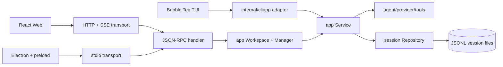

# gg 架构

`gg` 把产品行为收敛到可复用的 Go 核心里，每个界面都只是适配器。TUI、Web、Electron 客户端因此共享会话语义、并发规则、审批处理和工具执行。



## 包职责

| 包 | 职责 |
| --- | --- |
| `internal/app` | 应用用例：会话操作、轮次执行、运行生命周期、审批、事件回放，以及传输层安全的 DTO。 |
| `internal/session` | JSONL 持久化、会话树重建、迁移、持久化的分支 head、跨进程写锁、冲突检测，以及按稳定会话 ID 查找仓库。 |
| `internal/agent` | provider 主循环、工具调用、审批、流式 agent 事件。 |
| `internal/transport/jsonrpc` | 稳定的方法名和请求/响应校验。不含 UI 或文件系统策略。 |
| `internal/transport/stdio` | 面向本地子进程的并发换行分隔 JSON-RPC。 |
| `internal/transport/httpapi` | Bearer 保护的 RPC + 可回放的 SSE 事件，供浏览器部署。 |
| `internal/daemon` 与 `cmd/ggd` | 配置、provider、仓库、工作区、传输层的组装根。 |
| `internal/cliapp` | 只做 CLI/TUI 组装。业务行为委托给 `app.Service`。 |
| `internal/userprofile` | 用户画像（`~/.gg/USER.md`）：加载、解析、渲染 "who you are" 系统块。 |
| `internal/memory` | 结构化记忆存储（`~/.gg/memory/`）：精选 `MEMORY.md`、日常日志 `YYYY-MM-DD.md`、`people/` 和 `groups/` 笔记、旧版 `memory.md` 迁移、日常日志裁剪、关键词检索。 |
| `internal/scheduler` | Cron/单次任务定义、文件锁保护的 JSON 存储（`~/.gg/scheduler/`）、触发循环、无人值守审批策略。daemon 提供 `Executor`；核心除了 approver 类型外绝不 import agent 运行时。 |
| `internal/artifact` | 版本化的 agent 产出物：`~/.gg/artifacts/<id>/` 放 `artifact.json` 加不可变的 `v1.md`、`v2.md`……创建/版本/发布/删除；支持 markdown 和 HTML 类型；owner-only 权限（文件 0600、目录 0700）。版本分配和发布标记用 `artifacts.lock` 上的 flock 串行化。 |
| `internal/library` | 用户的精选文件集（`~/.gg/library/`）：扁平文件 + `index.json`（`id`、`name`、`source`、`size`、`added_at`）。接受上传（`Add`）和内存内容（`AddBytes`，artifact 发布时用）。修改用 `library.lock` 上的 flock 串行化；`index.json` 是保留名，冲突检测大小写不敏感。 |
| `internal/filelock` | 跨进程独占文件锁（flock），供 artifact 和 library 存储共用；不支持 flock 的平台显式报错。 |
| `internal/connector` | 第三方连接框架：OAuth 2.0 授权码流程（localhost 回调 + PKCE，`state` 防 CSRF）、token 持久化（`~/.gg/connectors/<name>.json`，0600，flock 串行化）、按需刷新。 |
| `internal/connector/google` | 第一个 provider：Gmail（搜索/读/发）和 Google Calendar（查/建）走纯 `net/http`；自动刷新 transport，401 重试一次。Scope：`gmail.readonly` + `gmail.send` + `calendar.events`。 |
| `internal/tools` | 内置 agent 工具实现，包括电脑操作工具（`computer.go` 加各 OS 后端 `computer_linux.go` / `computer_darwin.go`；Windows 和其他 Unix 用 unsupported stub）。信任边界：工具跑在用户自己的 OS 权限下——任何写操作或外部副作用都必须实现 `agent.ApprovalDescriber`，让每次调用都过审批流水线。 |
| `internal/mcp` | 基于官方 `modelcontextprotocol/go-sdk` 的 MCP 客户端：配置（`~/.gg/mcp.json`）、stdio/HTTP 建连、schema 适配、`mcp_<server>_<tool>` 工具桥。信任边界：server 是第三方代码——stdio 子进程只继承最小环境，每个 MCP 工具都走 approval，建连或 list 失败的 server 在 `Service` 生命周期内被跳过。 |
| `internal/tui` | 只做 Bubble Tea 状态和渲染；会话 DTO 来自核心。 |
| `ui/src` | 共享 React 界面和传输抽象。 |
| `ui/electron` | 原生窗口、工作区选择、sidecar 生命周期，以及窄而上下文隔离的 IPC 桥。 |

依赖指向内层：UI 和传输层依赖应用用例；应用层依赖 agent 和持久化抽象；核心绝不 import UI 或网络包。

## 个人层（画像 + 记忆）

`app.SetupPersonal(cfg)` 在每次 CLI 和 daemon 启动时运行，把个人层接入系统提示词：

1. `internal/userprofile`：加载 `~/.gg/USER.md`（`gg init` 创建；文件缺失没关系，失败也绝不阻塞启动），渲染紧凑的 "who you are" 块：名字/称呼、时区、语言、备注。
2. `internal/memory`：确保 `~/.gg/memory/` 存在，把旧版 `~/.gg/memory.md` 迁移成 `memory/MEMORY.md`（旧文件改名为 `memory.md.bak`，已有精选内容时绝不覆盖），裁剪过期的日常日志，给提示词内容做快照。

系统提示词组装顺序（代码指令之后）：用户画像、精选记忆（`MEMORY.md`）、今天的日常日志尾部（`YYYY-MM-DD.md`），然后是项目指令（AGENTS.md）和 skills。工具面：`memory_add` 接受 `scope=general|daily|person:<name>|group:<name>`（默认 general）；`memory_search` 跨 scope 做大小写不敏感的关键词检索，最多返回 10 条 `path:line: snippet`。记忆关闭时两者都隐藏。

## 定时任务（cron / 单次）

`internal/scheduler` 拥有任务定义和触发循环；`internal/daemon` 把它接入运行中的 daemon（`ggd`），`gg job ...`（在 `internal/cliapp`）从任意进程管理任务：

1. **存储**：`~/.gg/scheduler/jobs.json`（任务定义，rename 原子写）和 `runs.jsonl`（append-only 运行日志，每行一个 JSON）。所有 `jobs.json` 的读-改-写都用 `jobs.lock` 上的 `flock` 串行化（仅 Linux/macOS），CLI 和 daemon 可以并发改任务。纯读走 `View`，绝不重写文件。状态文件 owner-only（`0600`，目录 `0700`），和会话、记忆持久化一致。
2. **循环**：daemon 在后台跑 `Scheduler.Run(ctx)`（`ggd --no-scheduler` 关掉）。等下一次触发的等待上限 30s，循环睡觉时 CLI 新增/恢复的任务能及时被捡起。每次 tick 先把到期任务的持久化 `NextRun` 往前推，再派发 goroutine，所以长任务不会让循环在同一次触发上打转；上一轮还没跑完又到触发时间的，记一次 "skipped" 并同样推进 `NextRun`。每个任务还有内存级 guard 防止重叠执行。瞬时的存储错误（包括启动时 reconcile 失败）报到 daemon 的 stderr 并重试，不杀循环。
3. **执行**：每次触发在一个新会话（`scheduler/<name>-<timestamp>`）里跑一轮 agent，经 `app.Workspace.StartTurnWithApprover`，可审计、可恢复。任务的 `Timeout`（默认 10m）约束这一轮。任务记录创建时的工作区目录；daemon 只触发工作区和自己一致的任务（工作区跟踪之前建的任务，值为空，哪里都触发）。
4. **审批策略**：`scheduler.UnattendedApprover` 默认拒绝所有走 approval 的工具；建任务时加 `--allow-all` 才放行。这里是显式注入——scheduler 绝不依赖 nil approver（runner 会把 nil 当"全放行"）。
5. **重启语义**：cron 任务从当前时间重新排（错过的触发不补）；从没跑过、已过期的单次任务在 daemon 启动时补跑一次。daemon 写 `~/.gg/ggd.pid`，没 daemon 活着时 `gg job add` 会警告。

## Artifacts 与 library

`internal/artifact` 管版本化产出物；`internal/library` 管用户的文件集；两者在发布时交汇：

1. **存储**：`~/.gg/artifacts/<id>/artifact.json`（id、title、type、version、published_version、时间戳）加不可变的 `v<n>.md` / `v<n>.html`，全部原子写（临时文件 + rename）。`artifact_edit` 追加一个完整新版本——绝不做 diff 合并——每个版本都可复现。支持 `markdown` 和 `html` 两种类型；单版本内容上限 1 MiB，artifact 撑不爆 agent 上下文。所有读-改-写用 `artifacts.lock` 上的 `flock`（经 `internal/filelock`）串行化，CLI 和 daemon 并发编辑不会分到同一个版本号。`List` 永远返回非 nil 切片，空库时 JSON 调用方看到 `[]` 而不是 `null`。
2. **Agent 工具**：`artifact_create(title, type, content)` 和 `artifact_edit(artifact_id, content)`，store 打开时经 `app.toolProviders` 的 `artifact` 条目注册。两者都实现 `ApprovalRequest`（title/type/size 加修改前后内容预览），因为它们写工作区之外；无人值守审批器默认拒绝，除非任务开了 `--allow-all`。
3. **发布**：`gg artifact publish <id>` 和 Web 的 Publish 按钮（JSON-RPC `artifact.publish`）走同一条 `app.Workspace.PublishArtifact`：先把最新版本的字节存进 library（`library.AddBytes` → `~/.gg/library/<slug>.<ext>`，source `artifact:<id>`），再推进 artifact 的 `published_version`。调用方读和标记之间 artifact 出了新版本时，`Store.Publish(id, expectedVersion)` 报 `ErrVersionChanged` 拒绝——半存的 library 拷贝删掉，调用方重试，而不是记一个字节从没存过的 published 版本。
4. **Library**：`gg library add <path> [--name]` 把普通文件（≤ 50 MiB，按实际拷贝字节数算，不看拷贝前 stat）拷进 `~/.gg/library/`，命名防冲突；`index.json` 是唯一真相，原子更新。命名冲突大小写不敏感检测（macOS 默认文件系统大小写不敏感），`index.json` 是保留名会被拒绝，上传永远盖不掉也删不掉索引。所有修改走 `library.lock` 上的 `flock`，并发添加不会抢到同一个名字或丢条目。`library list|remove|path` 按 id 或大小写不敏感的 name 管理条目。
5. **Web**：`artifact.list` / `artifact.get` / `artifact.publish` 走现有 JSON-RPC 传输；`system.info` 广告 `artifact` 能力，Web 客户端只在连上的 daemon 报告该能力时才显示 Artifacts 页签。React Artifacts 页签用 `marked` 渲染 markdown，HTML 放在 `<iframe sandbox="">` 里（不执行脚本）。阅读器永远显示最新版本（发布后加的草稿也看得见）；`publishedVersion < version` 时出现 Publish 按钮。信任边界：artifact 内容来自本地用户自己的 agent 或文件，和聊天记录同等信任。

## 运行时模型

- `Workspace` 按稳定 ID 打开会话，绝不把会话文件路径暴露过网络边界。
- `Manager` 拥有打开的会话服务。不同会话可以并发跑，一个会话同时只允许一轮。不活跃会话按 LRU 驱逐，已完成的 run 按数量和时间过期。
- 每轮有一个 run ID。事件带单调递增序号，在有界保留窗口内可通过 `run.wait` 或 `/events` 回放。SSE 帧带序号和 idle 心跳，Web 客户端可以指数退避重连、从上一个事件续。掉队太多的客户端收到 `event_history_expired`，重载会话快照。
- `run.active` 和 `run.get` 暴露可重连的 run 状态，包括保留的序号窗口和待审批。Web 和 Electron 客户端重载后打开上次选中的会话、重新 attach 到它的 active run。
- 工具审批是异步的：`approval_requested` 事件暂停工具，`run.approve` 放行。取消和 steering 走同样的 run/session 边界。
- fork 和 clone 创建独立的 service 和 store。checkout 写一条 `head` 记录，重启后选中的树位置还在，即使没发新消息。
- JSONL 写用短生命周期的跨进程 lease 加乐观 head 校验。写过期了的 CLI 或 daemon 收到 `session_conflict`，而不是悄悄把分支交错写进同一个文件。

## 公开 JSON-RPC 接口

传输无关的方法：

- `system.info`：gg 协议版本和能力协商
- `session.list`、`session.create`、`session.open`、`session.get`、`session.rename`
- `session.action` 带 `tree`、`fork` 或 `clone`
- `run.start`、`run.wait`、`run.get`、`run.active`、`run.cancel`、`run.approve`、`run.steer`
- `artifact.list`、`artifact.get`、`artifact.publish`

stdio 每行一个 JSON-RPC 对象，支持并发请求（等审批时另一个请求必须能进）。HTTP 在 `POST /rpc` 接受 JSON-RPC；`GET /events` 以 SSE 流式推送 run 事件。HTTP 模式要求 Bearer token，默认只绑 loopback，除非显式 `--allow-remote`。线格式保持 JSON-RPC 2.0；`system.info.protocolVersion` 独立给 gg 方法、事件、DTO 和稳定应用错误码做版本。

## 客户端边界

React 应用依赖一个小 `Transport` 接口。`WebTransport` 默认调同源 HTTP。`ElectronTransport` 只调 `preload.cjs` 白名单暴露的方法；renderer 拿不到 Node.js。Electron 主进程拥有 `ggd` 和选中的工作区。

## 扩展规则

加行为时：

1. 用例和测试放 `internal/app`。
2. 持久化改动走 `session.Repository`。
3. 客户端需要时才暴露传输无关的方法/事件。
4. Web 或 Electron 特有的策略留在各自 adapter。
5. 文件路径、provider 密钥、不受限的 IPC 不进公开 DTO。
6. 新 agent 能力做成 `ToolProvider` 条目、MCP server 声明或 skill——绝不写中央 if/else 链。写操作或外部副作用要实现 `agent.ApprovalDescriber`，让无人值守审批器默认拒绝。
7. 平台/环境相关的工具经 `Available`/`Build` 降级，不可用时绝不广告；`ToolCapabilities()` 永远从 registry 推导。
8. 外部代码和提示词内容（MCP server、skill）跑在最低信任级：清洗过的子进程环境、approval-gated 的工具、fail-skip 而不是 fail-fatal。

这样未来的移动客户端、远程 Web 部署或另一种终端 UI 都只是再一个 adapter，而不是再实现一遍 agent。

### 添加 agent 工具

工具由 `ToolProvider` 注册表（`internal/app/toolregistry.go`）每轮组装：每个 provider 的 `Build` 返回一个能力的工具，返回 nil 切片或报错就把该能力降级为不存在，不影响其他。要加工具：

1. 在 `internal/tools`（或该能力自己的包）实现 `agent.Tool`。
2. 在 `toolProviders` 里新增或扩展一个 `ToolProvider` 条目——绝不写中央 if/else 链。
3. 工具做写操作或外部副作用就实现 `agent.ApprovalDescriber`，让每次调用都过审批流水线（无人值守审批器默认拒绝 approval-gated 的工具，除非任务 opt in）。

传输层经 `app.ToolCapabilities()` 广告能力，它从注册表推导，广告的集合不可能和实际注册的工具脱节。

### MCP 服务器

MCP 的外部工具来自 `~/.gg/mcp.json` 里声明的服务器：

```json
{"servers": {
  "filesystem": {"command": "npx", "args": ["-y", "@modelcontextprotocol/server-filesystem", "/data"], "env": {"API_KEY": "..."}},
  "remote": {"url": "https://example.com/mcp"}
}}
```

`internal/mcp` 连接每个服务器（stdio 子进程或 streamable HTTP），把它的工具适配成 `mcp_<server>_<tool>`（清洗成 function-calling 安全的名字，最长 64 字符，冲突加数字后缀）。server 工具永远实现 `ApprovalDescriber`：每个 MCP 调用都走 approval。连接按 `Service` 缓存（一轮会话只 dial 一次），`Service.Close` 时回收。建连或 list 失败的服务器在 Service 生命周期内被跳过，一个坏服务器拖不慢每一轮。stdio 服务器只继承最小环境（PATH/HOME 加服务器自己的 `env`），父进程环境绝不整份透传。

### Skills

Skills（`internal/skills`）是第三层扩展：markdown playbook，从项目 skill 根和 `~/.agents/skills` 加载，模型按需读。skill 只加知识和流程，不加代码执行——agent 用现有工具面执行 skill 步骤，审批策略继承所用工具的。信任边界：skill 是来自仓库或用户自己文件的提示词内容；第三方 skill 文本按不可信的提示词输入对待。

### 扩展层级

三层，按信任从高到低：

1. **内置 provider**（`internal/app/toolregistry.go`）：编译进 gg，每轮构建，前置条件缺失（没装 Chromium、Google 没连接）或平台不支持时经 `Available` 门降级为不存在。写操作和外部副作用实现 `agent.ApprovalDescriber`。现成例子：电脑操作工具——`internal/tools/computer.go` 加各 OS 后端；Windows 和其他 Unix 上这个能力既不构建也不广告。
2. **MCP 服务器**（`~/.gg/mcp.json`、`internal/mcp`）：外部进程暴露工具为 `mcp_<server>_<tool>`；永远走 approval；连接按 `Service` 缓存；坏服务器被跳过，绝不致命。
3. **Skills**（`internal/skills`）：模型按需读的 markdown 流程；不跑新代码；审批来自步骤所用的工具。

`app.ToolCapabilities()` 从注册表推导广告集合，客户端永远看不到建不出来的能力的工具。

## 质量门禁

每个 PR 都要带着绿色 CI 来、保持可 review：

- **CI**：6 个 check（ubuntu-latest 和 macos-latest 的 Go、Web、Electron）必须过；`go vet ./...` 在 CI 跑，必须干净。
- **Race**：`internal/app`、`internal/session`、`internal/transport/...` 跑 `go test -race`（CI 在 Linux 跑）。
- **格式**：`gofmt -l` 干净。push 前本地跑 `make check`——它跑格式、vet 和全量测试。
- **新包**：接口先行、核心路径单测、类型化错误、导出符号写 doc 注释。
- **大小**：PR 控制在 ~500 行以内，一个 reviewer 能装进脑子；大的拆成 stacked phases。
- **Review**：Codex review 意见独立核实——先对照代码确认再修，不唯 review 是从。有效的 P0/P1/P2 修掉；P3 看判断。CI 全绿才合。
- **平台**：正式支持 Linux 和 macOS。`internal/tools` 和 `internal/app` 还必须能为 Windows 编译（`GOOS=windows go build`），每个平台拆分的新文件都要配 `other` stub，保证任意 Unix 目标都能编译。
